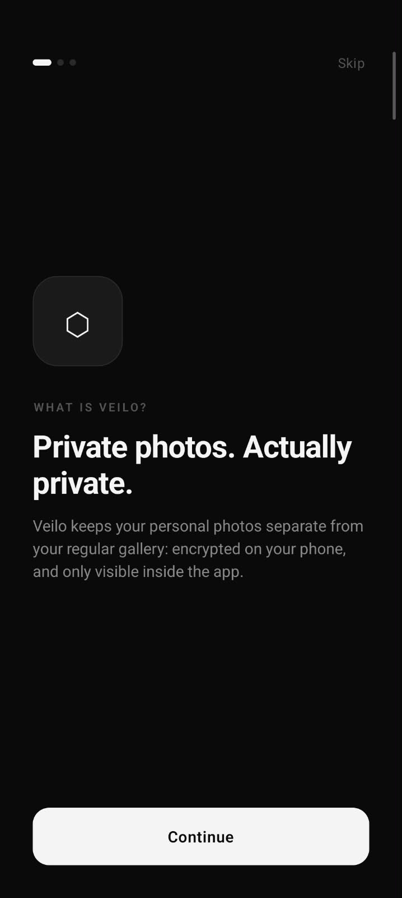
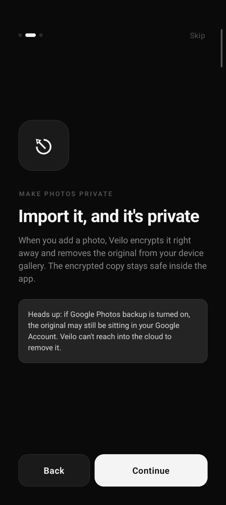
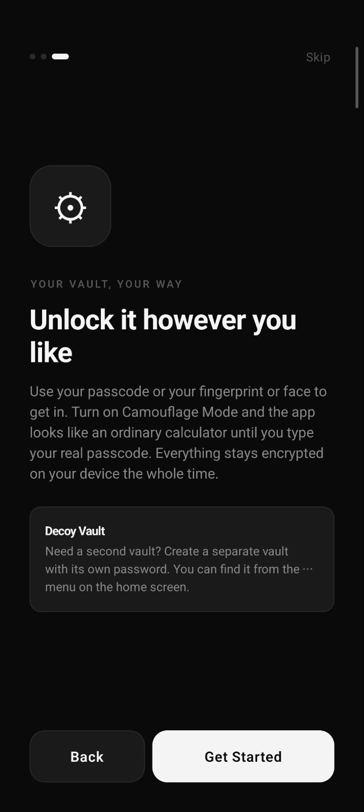
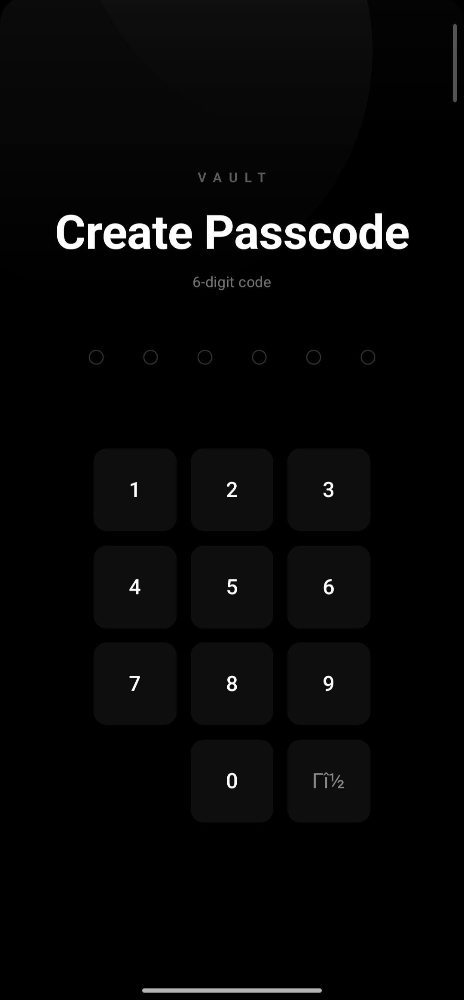
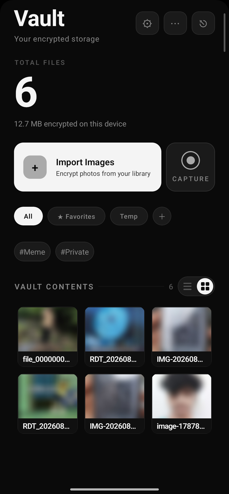
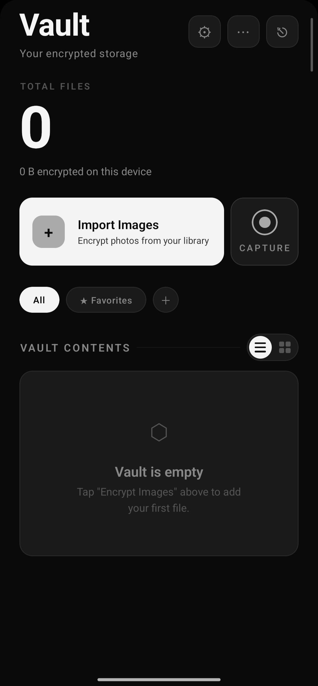
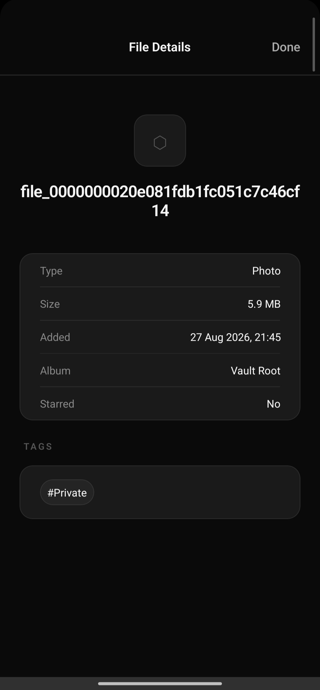
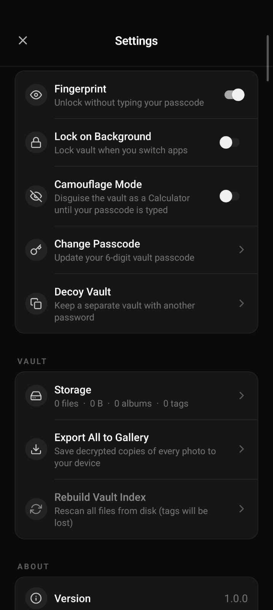
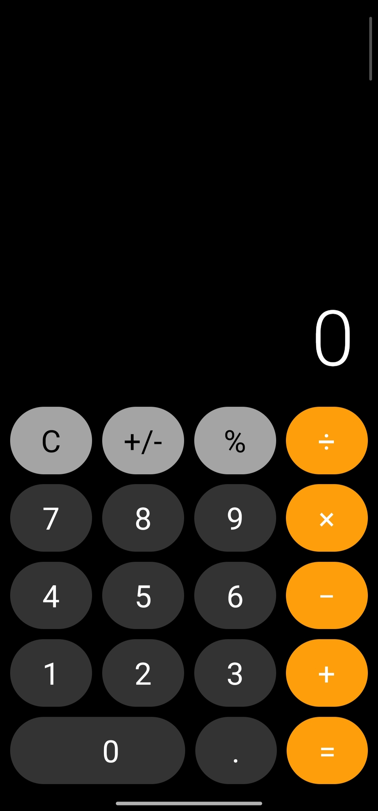
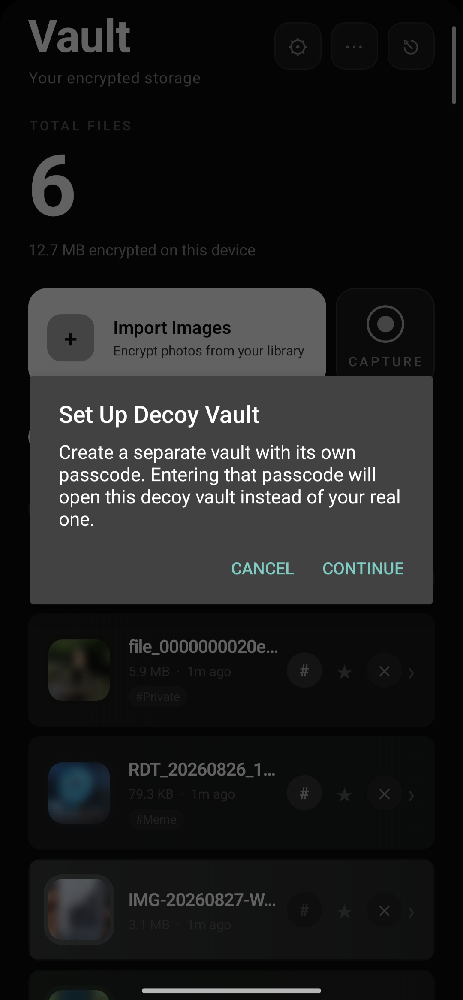

# Veilo

Private photos. Actually private.

Veilo is a private, encrypted photo vault for Android and iOS, built with Expo and React Native.

Veilo keeps a set of photos completely separate from your normal device
gallery. Import a photo, it's encrypted on-device with AES-256, and the
original is removed from your gallery. Nothing is ever uploaded anywhere:
there is no backend, no account, and no network dependency for any vault
operation.

> **Status:** v1.0.0, feature-complete, developed and tested primarily on
> Android. See [Known Limitations](#known-limitations).

---

## Screenshots

<table>
  <tr>
    <td align="center" width="25%">
      
      <br/><sub><b>Onboarding</b></sub>
    </td>
    <td align="center" width="25%">
      
      <br/><sub><b>Onboarding</b></sub>
    </td>
    <td align="center" width="25%">
      
      <br/><sub><b>Onboarding</b></sub>
    </td>
    <td align="center" width="25%">
      
      <br/><sub><b>Create Passcode</b></sub>
    </td>
    <td align="center" width="25%">
      
      <br/><sub><b>Home / Vault</b></sub>
    </td>
    <td align="center" width="25%">
      
      <br/><sub><b>Empty Vault</b></sub>
    </td>
  </tr>
  <tr>
    <td align="center" width="25%">
      
      <br/><sub><b>File Details</b></sub>
    </td>
    <td align="center" width="25%">
      
      <br/><sub><b>Settings</b></sub>
    </td>
    <td align="center" width="25%">
      
      <br/><sub><b>Camouflage Mode</b></sub>
    </td>
    <td align="center" width="25%">
      
      <br/><sub><b>Decoy Vault</b></sub>
    </td>
  </tr>
</table>

---

## Table of Contents

- [Screenshots](#screenshots)
- [Why Veilo exists](#why-veilo-exists)
- [Core features](#core-features)
- [The Make Private workflow](#the-make-private-workflow)
- [Google Photos / cloud backup caveat](#google-photos--cloud-backup-caveat)
- [Camouflage Mode](#camouflage-mode)
- [Decoy vault](#decoy-vault)
- [Biometric unlock](#biometric-unlock)
- [Albums, tags, and favorites](#albums-tags-and-favorites)
- [Grid / List views](#grid--list-views)
- [Encrypted thumbnails](#encrypted-thumbnails)
- [Image Viewer](#image-viewer)
- [Export to Gallery](#export-to-gallery)
- [Security & privacy architecture](#security--privacy-architecture)
- [Platform support](#platform-support)
- [Tech stack](#tech-stack)
- [Project structure](#project-structure)
- [Installation & setup](#installation--setup)
- [Development](#development)
- [EAS build instructions](#eas-build-instructions)
- [Testing an APK on a device](#testing-an-apk-on-a-device)
- [Production AAB build](#production-aab-build)
- [Known limitations](#known-limitations)
- [Roadmap / future ideas](#roadmap--future-ideas)
- [Contributing](#contributing)
- [License](#license)

---

## Why Veilo exists

Most phone galleries are shared, synced, and backed up by default. A photo
you take ends up visible to anyone who picks up your phone, and often gets
copied to a cloud service automatically. There's no simple, built-in way to
keep a few photos genuinely private on your device, without trusting some
random third-party "vault" app or managing encrypted archives by hand.

Veilo is a small, local-only answer to that. Photos you choose to protect
get encrypted with a real cipher, keyed by a passcode only you know, and
removed from the places your phone would otherwise show or sync them. It's
also honest about what it can't do (see the Google Photos caveat below).

## Core features

- **AES-256-CBC encryption**, keyed via PBKDF2-SHA256, for every imported
  image, powered by `react-native-aes-crypto` (native crypto, not a pure-JS
  implementation).
- **Make Private import flow**: import, encrypt, confirm, then remove the
  original from the device gallery, with a clear warning about cloud
  backups first.
- **Direct-to-vault camera capture**: photos taken in-app are encrypted
  immediately and never touch the device gallery at all.
- **Real + Decoy vault**: a second, fully independent password-protected
  vault for plausible deniability.
- **Camouflage Mode**: disguises the entire app as a working calculator.
- **Biometric unlock** (Face ID / Fingerprint) for the real vault.
- **Albums, tags, and favorites** for organizing the vault.
- **List and Grid views**, encrypted thumbnails, and a full-featured
  pinch-to-zoom image viewer.
- **Export to Gallery**: decrypt one photo, or every photo in the vault, back
  out to your device's normal Photos/Gallery on demand.
- **Screen capture protection**: blocks screenshots, screen recording, and
  recent-apps thumbnails while the app is open (Android; iOS has hard
  platform limitations here, documented below).
- No backend, no account, no analytics, no network calls for any vault
  operation.

## The Make Private workflow

1. Tap **Import Images** and pick photos from your gallery (Android uses a
   custom native picker; see [Security & privacy architecture](#security--privacy-architecture)).
2. Veilo encrypts each photo into the active vault and generates an
   encrypted thumbnail.
3. Before removing anything from your gallery, Veilo shows a **Make
   Private** confirmation explaining exactly what's about to happen, and
   surfaces the Google Photos caveat below. You can back out with
   **Cancel** and nothing gets touched.
4. On confirmation, Veilo attempts to delete the original from your
   device gallery:
   - **Android:** tries `DocumentsContract.deleteDocument()` directly on the
     picked document first (no extra system dialog), falling back to
     `MediaStore.createDeleteRequest()` (one OS confirmation dialog for the
     whole batch) only for items that don't support direct deletion.
   - **iOS:** uses the standard `expo-media-library` deletion flow.
5. If a given photo's provider doesn't support deletion, that one original
   is left untouched, and the app never pretends otherwise. Deletion is
   only ever attempted for items it can positively identify, never guessed
   at.

The encrypted copy is verified on disk (existence and non-zero size) and
recorded in the vault's index before any deletion is attempted. Nothing is
removed from your gallery unless the encrypted copy is already safely
stored.

## Google Photos / cloud backup caveat

**Veilo cannot remove a photo from Google Photos, iCloud, or any other
cloud backup.** It only ever operates on your device's local gallery. If
Google Photos (or another) backup is enabled for the photo you imported,
the original may still exist in your Google Account and on any other
synced device, and can even reappear in your local gallery the next time
that backup syncs. The Make Private confirmation screen states this
plainly before you confirm. The guidance offered is: turn off backup for
those photos, or delete them from Google Photos directly, if you need them
fully gone from the cloud too.

## Camouflage Mode

When enabled, Veilo's lock screen is replaced by a genuine, fully working
four-function calculator. There's no visible "vault" affordance anywhere:
to anyone looking, it's just a calculator app. Typing your real vault
passcode on the calculator's number pad (the digits can be spread across
an otherwise ordinary-looking calculation, e.g. `12+58-0=`, since operators
never reset the detection buffer) silently unlocks the vault and
transitions to the normal Veilo UI. Toggle it in **Settings > Security >
Camouflage Mode**.

## Decoy vault

A second, independent passcode can be configured for a **decoy vault**: a
separate encrypted storage area with its own files, albums, and settings.
Entering the decoy passcode (instead of your real one) unlocks that vault
instead, showing only whatever you've chosen to keep there. The real
vault's existence isn't revealed by unlocking the decoy. Biometric unlock
is only ever enrolled for the real vault's passcode, never the decoy.

## Biometric unlock

Face ID or fingerprint unlock can be enabled for the real vault once it's
set up (**Settings > Security**). The passcode is stored under a
biometric-gated SecureStore key (`requireAuthentication: true`), so
retrieval is tied to the OS-level biometric/Keychain prompt. Veilo never
handles or stores biometric data itself, that's entirely the OS's job. If
enrollment changes or the OS invalidates the key, biometric unlock is
automatically disabled rather than silently failing.

## Albums, tags, and favorites

- **Albums**: organize vault files into named albums, move files between
  them, rename or delete an album (files move back to the vault root, they
  are never deleted with the album).
- **Tags**: free-form tags per file, with filter chips generated from
  whatever tags currently exist across the vault (OR filtering across
  selected tags).
- **Favorites**: star any file, filter the vault down to favorites only.

All three work both per-file and as batch actions across a multi-selection.

## Grid / List views

Toggle between a detailed list (filename, size, date, album, tag chips) and
a compact photo grid from the home screen's view toggle. Both share the
same underlying data and thumbnail cache, so switching is instant with no
re-decryption involved.

## Encrypted thumbnails

Each imported photo gets a small, separately-encrypted `.thumb` sidecar
file (resized, JPEG-compressed) generated at import time, plus 2 to 3
dominant colors sampled from it. The grid/list only ever decrypts this
small thumbnail for display. The full-resolution image is decrypted on
demand, only when you actually open it in the viewer. If thumbnail
generation fails for any reason, the UI falls back to a plain placeholder
instead of blocking the import.

## Image Viewer

A custom, from-scratch full-screen viewer: pinch-to-zoom (0.8x to 6x),
double-tap zoom, momentum panning with edge clamping, swipe-down-to-close,
auto-hiding chrome, and a "..." menu for Move to Album / Add Tags / Export
to Gallery / Delete. The full-resolution image decrypts in the background
while the cached thumbnail shows immediately, so opening a photo is never a
blank or blocking screen.

## Export to Gallery

- **Single photo**: from the viewer's "..." menu, decrypt one photo and
  save it back to your device's normal Photos/Gallery via
  `MediaLibrary.saveToLibraryAsync`. The encrypted original in the vault is
  never modified or deleted by this.
- **Export All**: from **Settings > Vault**, decrypt and export every photo
  currently in the vault in one batch, with per-photo progress and a clear
  summary at the end (e.g. "18 of 20 saved to Photos, 2 failed"). One
  failed file never stops the rest of the batch. Gallery write permission
  is requested once for the whole operation.

## Security & privacy architecture

- **Encryption:** AES-256-CBC via `react-native-aes-crypto` (native,
  hardware-backed where the platform supports it), key derived per-file
  with PBKDF2-SHA256 from your passcode and a random salt.
- **Passcode:** your 6-digit passcode is the key-derivation material
  itself. It's never stored in plaintext, and is held only in memory for
  the duration of an unlocked session.
- **No cloud, no accounts:** every operation (encrypt, decrypt, index,
  thumbnails, activity log) happens entirely on-device via
  `expo-file-system` and `expo-secure-store`. Veilo makes no network
  requests for any vault functionality.
- **Screen capture protection:** `expo-screen-capture` sets `FLAG_SECURE`
  on Android, blocking screenshots, screen recording, and
  recents-thumbnails while the app is open. On iOS this can only *detect*
  a screenshot after the fact and black out the screen during active
  screen recording. Apple provides no API to block a screenshot outright,
  and recents-thumbnail suppression isn't possible either. These are hard
  OS limitations, not gaps in Veilo's implementation.
- **Auto-lock:** an optional "Lock on Background" setting re-locks the
  vault as soon as the app is backgrounded, clearing the in-memory
  passcode and decrypted-thumbnail cache.
- **Deterministic gallery deletion (Android):** rather than trust
  `expo-image-picker`'s unreliable asset-id resolution, Android import
  uses a small local native Expo module (`modules/media-store-resolver`)
  built specifically for this app. It picks via `Intent.ACTION_OPEN_DOCUMENT`
  (Storage Access Framework), retains a persistable permission grant on
  the exact document the user picked, and only ever attempts deletion
  through OS-documented, positively-identified paths
  (`DocumentsContract.deleteDocument`, `MediaStore.createDeleteRequest`),
  never by guessing a filename, path, or asset ID.
- **Deletion is never destructive to the vault copy:** the original is
  only ever considered for removal after the encrypted copy is verified on
  disk and recorded in the vault index. A failed or declined deletion is
  always non-fatal, the encrypted copy is already safe either way.

## Platform support

- **Android**: the primary, fully-featured target. Custom native picker
  and deletion module (above), edge-to-edge UI, tested against the real
  gallery-deletion flow across multiple rounds of on-device debugging.
- **iOS**: uses the standard `expo-image-picker` + `expo-media-library`
  flow (documented and implemented, unchanged from Expo's normal APIs).
  This path has **not** been verified on a physical iOS device or
  simulator during this development cycle, see
  [Known Limitations](#known-limitations).

## Tech stack

- **Expo SDK 53** / **React Native 0.79.6** / **React 19**, TypeScript
  (strict mode)
- **React Native New Architecture** enabled (`newArchEnabled: true`)
- `react-native-reanimated` for all animation (gesture-driven UI, no
  `Animated` API usage)
- `react-native-gesture-handler` for pinch/pan/swipe in the Image Viewer
- **NativeWind (Tailwind for React Native)** for a subset of screens, plain
  `StyleSheet` + design tokens (`utils/design.ts`) elsewhere
- `@shopify/flash-list` for the vault grid/list
- `expo-secure-store`, `expo-local-authentication`, `expo-crypto`,
  `expo-file-system`, `expo-media-library`, `expo-image-picker` (iOS),
  `expo-screen-capture`, `expo-image-manipulator`, `react-native-image-colors`
- `react-native-aes-crypto` for native AES-256/PBKDF2
- A local, custom Expo native module (Kotlin), `modules/media-store-resolver`,
  for Android-only deterministic gallery picking/deletion

## Project structure

```
Veilo/
├── App.tsx                        # Root: auth-aware routing, onboarding gate, screen security
├── app.json / eas.json            # Expo config + EAS build profiles
├── hooks/
│   ├── useAuth.tsx                # Vault auth context: unlock, setup, biometrics, lock-on-background
│   ├── useAlbums.ts                # Album CRUD
│   ├── useOnboarding.tsx           # First-launch intro persistence
│   ├── useUnlockTransition.ts      # Shared unlock animation state machine
│   └── useVaultOperations.ts       # Encrypt/decrypt/capture/export orchestration
├── screens/
│   ├── LockScreen.tsx               # Passcode entry + first-time setup
│   ├── CamouflageCalculator.tsx      # Calculator disguise + secret-passcode detection
│   ├── OnboardingIntro.tsx           # 3-screen first-launch explainer
│   ├── HomeScreen.tsx                # Vault grid/list, import, capture, filters
│   └── SettingsScreen.tsx            # Security, vault, and about settings
├── components/                    # ImageViewer, MakePrivateSheet, MoveFileSheet, TagSheet,
│                                    # AlbumFilterBar, DecoySetupSheet, ProgressOverlay, etc.
├── services/
│   ├── encryption.ts               # AES-256-CBC + PBKDF2 (react-native-aes-crypto)
│   ├── BiometricService.ts         # Biometric-gated SecureStore passcode storage
│   ├── SecureCameraService.ts      # Camera permission + capture (never touches the gallery)
│   ├── ScreenSecurityService.ts    # FLAG_SECURE / preventScreenCaptureAsync
│   ├── thumbnailCache.ts           # Decrypted-thumbnail memory/disk cache
│   ├── AlbumService.ts / AlbumErrors.ts
│   └── storage/                    # VaultStorage, VaultIndex, passcode hashing
├── modules/media-store-resolver/  # Local Expo native module (Android): SAF picker + deletion
├── utils/design.ts                # Design tokens: colors, spacing, typography, radius
└── android/                       # Committed prebuild output (custom native module requires it)
```

## Installation & setup

### Prerequisites

- Node.js 18+
- An Expo/EAS account (for building, `npx expo login`)
- Android: Android Studio + an SDK/emulator, or a physical device with USB
  debugging enabled
- iOS: a macOS machine with Xcode, if building/running locally (not
  required for Android-only development)

### Install

```bash
git clone <this-repo>
cd veilo
npm install
```

Because this project ships a **custom local native module**
(`modules/media-store-resolver`), it cannot run in Expo Go, you need a
development build (see below).

## Development

```bash
# Generate native android/ (and ios/) projects from app.json + installed plugins
npx expo prebuild

# Run on a connected Android device/emulator (builds + installs a dev client)
npx expo run:android

# Start the Metro dev server for an already-installed dev/dev-client build
npx expo start
```

`npx expo run:ios` is available the same way on macOS, but the iOS path
hasn't been exercised in this development cycle, expect to do some of your
own verification there.

### Environment / setup requirements

- No `.env` file or API keys are required. Veilo makes no network calls.
- `app.json`'s `extra.eas.projectId` and `owner` are tied to the original
  EAS project. Running your own EAS builds requires either your own EAS
  project (`eas init`) or access to the existing one.
- Android builds need `ANDROID_HOME`/`local.properties` configured with a
  valid SDK path if building locally rather than via EAS.

## EAS build instructions

```bash
npm install -g eas-cli   # if not already installed
eas login

# Development client (installs the custom native module, for local `expo start`)
eas build --profile development --platform android

# Internal/preview build for testing (APK, installable directly)
eas build --profile preview --platform android

# Production build (AAB, for Play Store submission)
eas build --profile production --platform android
```

`eas.json`'s `production` profile has `autoIncrement: true` and
`appVersionSource: "remote"`, so EAS manages the build number for you
across production builds.

## Testing an APK on a device

1. Run `eas build --profile preview --platform android` (see above), this
   profile produces an installable `.apk`, not an `.aab`.
2. Once the build finishes, download the APK from the link EAS CLI prints
   (or from your [expo.dev](https://expo.dev) project dashboard).
3. Transfer it to an Android device (ADB, direct download link, or any
   file transfer method) and install it. You'll need to allow "install
   from unknown sources" for whichever app you use to open the APK, since
   it isn't from the Play Store.
4. Alternatively, with a device connected via USB and debugging enabled:
   ```bash
   adb install path/to/veilo.apk
   ```
5. On first launch, walk through the onboarding intro, set up your real
   vault passcode, and test the core flows: import, Make Private, confirm,
   verify the photo is encrypted in the vault and removed from the device
   gallery, then Export to Gallery to verify the round trip.

## Production AAB build

```bash
eas build --profile production --platform android
```

This produces a signed `.aab` (Android App Bundle) suitable for upload to
the Google Play Console. **Publishing to Google Play is a separate step
this repository does not automate**, see the release notes for this
version for the current status.

## Known limitations

- **iOS has not been verified on a physical device or simulator** during
  this development cycle. The iOS code paths (`expo-image-picker`,
  `expo-media-library` deletion, screen-capture handling) exist and follow
  documented Expo APIs, but haven't been through the same on-device
  debugging Android received.
- **Veilo cannot delete cloud-backed copies** of a photo (Google Photos,
  iCloud, etc.), see the [Google Photos caveat](#google-photos--cloud-backup-caveat)
  above. This is a deliberate, disclosed limitation, not a bug.
- **On Android, gallery deletion depends on what the source provider
  supports.** If a picked photo's provider doesn't support
  `DocumentsContract.deleteDocument` or `MediaStore.createDeleteRequest`,
  the original is left in place, and this is reported clearly rather than
  silently failing or being forced.
- **No automated test suite.** Verification for this release relied on
  `tsc --noEmit` (strict + unused-locals/params), manual on-device testing
  of the core flows, and targeted code audits. There are no unit/integration
  tests in this repository yet.
- **No Play Store listing yet.** This release provides an installable APK
  only; Play Store submission is a separate, not-yet-completed step.
- Very large images or very large vaults haven't been specifically
  stress-tested for performance.

## Roadmap / future ideas

*(Ideas only, none of the following are implemented in v1.0.0.)*

- Automated test coverage (unit tests for encryption/storage, integration
  tests for the import/delete flow)
- iOS on-device verification and a first TestFlight build
- Google Play Store listing and submission
- Passcode-protected app-level backup/restore of the encrypted vault (still
  fully local, e.g. export/import an encrypted vault archive)
- Per-album passcodes or additional decoy vaults
- Video support (currently images only)

## Contributing

This repository does not yet have a formal contribution process (no
`CONTRIBUTING.md`, issue templates, or CI). If you'd like to contribute:

1. Open an issue describing the change you'd like to make before submitting
   a large PR. This is a security-sensitive app, so changes to the
   encryption, storage, or deletion pipeline especially benefit from
   discussion first.
2. Keep changes scoped and run `npx tsc --noEmit` (and ideally
   `npx tsc --noEmit --noUnusedLocals --noUnusedParameters`) before opening
   a PR.
3. Match the existing code style (see `utils/design.ts` for design tokens,
   and existing components/services for conventions). This project
   intentionally avoids unrequested abstractions and dead code.

## License

No open-source license has been granted for this project yet, all rights
are reserved by the author. The source is visible on GitHub for
transparency, but reuse, redistribution, or forking beyond what GitHub's
own terms of service permit is not authorized at this time. If you're
interested in using this code under an open-source license, please open an
issue.
